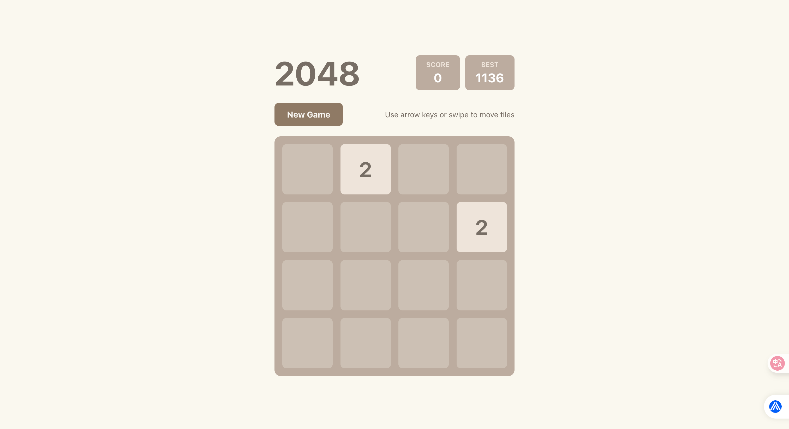
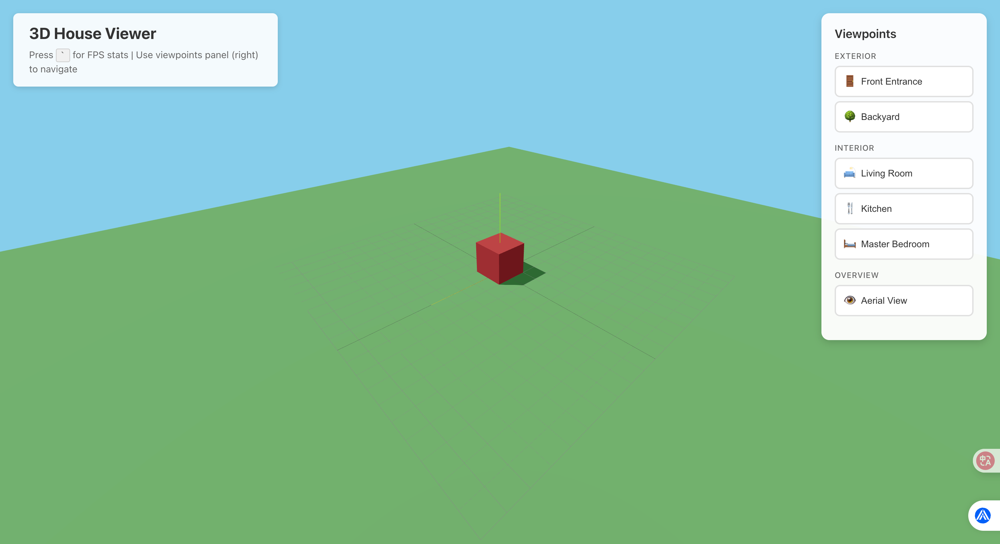

# Speckit学习

五个步骤：
1. /speckit.constitution 定义规范(如/speckit.constitution Create principles focused on code quality, testing standards, user experience consistency, and performance requirements)

2. /speckit.specify 描述特征需求(比如说：我要创建一个web应用，包含用户登录、数据可视化等功能 || 我要创建一个移动应用，包含拍照上传、社交分享等功能 || 我要创建一个游戏，包含角色扮演、任务系统等功能)

(可选步骤：/speckit.clarify 进一步澄清需求，Claude询问用户几个问题，用户回答后，Claude会更新.spec文件)

3. /speckit.plan 描述使用的技术栈

4. /speckit.tasks 直接执行命令，生成tasks.md可执行的逻辑型任务清单

(可选步骤：/speckit.analyze 校验spec/plan/tasks一致性输出冲突和遗漏)

5. /speckit.implement 直接执行命令，会根据tasks.md任务清单开始生成代码，每完成一个任务就会更新tasks.md的状态，直到所有任务完成。

/speckit.constitution中文示例：
```
/speckit.constitution

请使用以下规则：

Writing Style Rules
1. 受众是"新入职的前端/后端/QA/设计同学"
2. 优先使用短句；每段 ≤5 行
3. 专业词首次出现时给白话释义
4. 每个需求点包含：是什么 / 为什么 / 怎么验收
5. 禁止空话：删除"全面提升/显著增强"等无证据描述

Output Contract
1. spec.md 最前方包含《上下文摘要》
2. 不确定时产出"澄清清单"
3. 所有表格使用 Markdown 格式

Product Rule
1. 所有流程要尽可能短，减少用户操作
2. 要保证功能符合当地法律法规，并以用户的隐私和安全优先/*不可协商*/
```

speckit开发流程：
constitution -> specify -> (clarify) -> plan -> tasks -> (analyze) -> implement


# Speckit学习-2048游戏 :sparkles:

项目根据Speckit框架规范和Claude开发实现。

技术栈：React JavaScript Vite

实现效果如图：



# Speckit学习-3D看房项目 :house:

项目根据Speckit框架规范和Claude开发实现。

技术栈：React JavaScript Three.js Drei.js Vite

实现效果如图：

